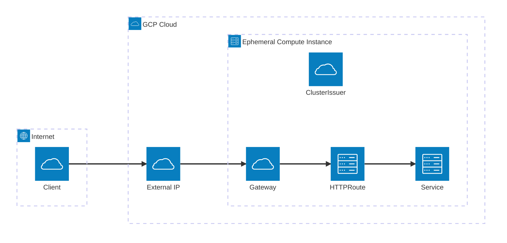

%% You can rename or add participants and steps as needed
%% Use |Lane Name| to define swimlanes

Internet
   │
   ▼
[GCP External IP / LoadBalancer]
   │
   ▼
[Compute Instance NIC]
   │
   ▼
[Cilium eBPF / Network Policy]
   │
   ▼
[Envoy Proxy]
   │
   ▼
[Gateway API Listener] -- TLS via ClusterIssuer
   │
   ├──> [HTTPRoute 1] --> [Service 1 / Pod]
   ├──> [HTTPRoute 2] --> [Service 2 / Pod]
   ├──> [HTTPRoute 3] --> [Service 3 / Pod]
   └──> [HTTPRoute 4] --> [Service 4 / Pod]
   │
   ▼
Response flows back